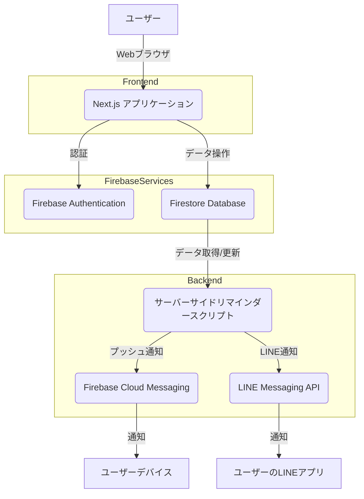

# のむRhythm - 開発者向けアーキテクチャ概要

このドキュメントでは、服薬管理アプリケーションの主要なコンポーネントとその相互作用について説明します。

## 1. 全体アーキテクチャ概要

本アプリケーションは、主に以下のコンポーネントで構成されています。

- **Next.js フロントエンド**: ユーザーインターフェースを提供し、Firebase Authentication を介してユーザー認証を行い、Firestore と直接通信してデータ操作を行います。
- **Firebase**:
    - **Firestore**: ユーザーデータ、服薬記録、設定、LINE連携情報などを保存するNoSQLデータベース。
    - **Firebase Authentication**: ユーザー認証を管理します。
    - **Firebase Cloud Messaging (FCM)**: プッシュ通知の送信基盤として利用されます。
- **LINE Messaging API**: LINEへの通知送信に利用されます。
- **サーバーサイドリマインダースクリプト**: 定期的に実行され、Firestoreからリマインダー設定を読み込み、FCMおよびLINE Messaging APIを介して通知を送信します。

## 2. 主要コンポーネント詳細

### 2.1. Next.js アプリケーション (フロントエンド)

- **技術スタック**: Next.js, React, TypeScript, Tailwind CSS, Shadcn/ui
- **役割**:
    - ユーザー登録、ログイン、ログアウト機能。
    - 服薬情報の入力、編集、削除。
    - 服薬スケジュールの管理。
    - 残薬数の管理と表示。
    - ユーザー設定（通知設定など）の管理。
    - Firebase Authentication を利用した認証状態の管理。
    - Firestore との直接的なデータ同期。
- **デプロイ**: Vercel などのプラットフォームにデプロイされることを想定。

### 2.2. Firebase

- **Firestore**:
    - **`users` コレクション**: ユーザーごとの基本情報。
    - **`medications` コレクション**: 各ユーザーの服薬情報（薬の名前、残数、服用頻度など）。
    - **`userSettings` コレクション**: ユーザーごとの通知設定、リマインダー時間など。
    - **`lineConnections` コレクション**: アプリケーションユーザーIDとLINEユーザーIDの紐付け情報。
- **Firebase Authentication**:
    - メール/パスワード認証を主に使用。
    - ユーザーセッションの管理。
- **Firebase Cloud Messaging (FCM)**:
    - Webプッシュ通知の送信に利用されるが、現在はLINE通知が主。将来的な拡張性として残されている。

### 2.3. LINE Messaging API

- **役割**: ユーザーのLINEアプリへの通知送信。
- **連携**: サーバーサイドリマインダースクリプトから、LINE Messaging API を介してメッセージを送信。`lib/notifications.ts` 内の `sendLineNotification` 関数がこの処理を担う。
- **認証**: LINE Channel Secret と Channel Access Token を使用して認証。

### 2.4. サーバーサイドリマインダースクリプト

- **技術スタック**: Node.js, TypeScript, Firebase Admin SDK
- **役割**:
    - 定期的に（例: cronジョブにより5分ごと）実行される。
    - Firestore から `userSettings` を読み込み、設定されたリマインダー時刻と現在の時刻を比較。
    - 残薬通知のロジック (`checkAndSendLowMedicationAlerts` 関数) を実行し、残薬が少なくなった薬がある場合に通知をトリガー。
    - リマインダー時刻が一致した場合、または残薬通知が必要な場合に、`sendLineNotification` 関数を呼び出し、LINE Messaging API を介して通知を送信。
- **デプロイ**: Next.js アプリケーションとは独立したサーバー（VPS、専用サーバーなど）で実行されることを想定。

## 3. データフローの概要

1.  **ユーザー操作**: Next.js アプリケーションを通じて、ユーザーは服薬情報や通知設定をFirestoreに保存します。
2.  **リマインダー処理**:
    - サーバーサイドリマインダースクリプトが定期的に起動します。
    - スクリプトはFirestoreからユーザー設定と服薬データを取得します。
    - 設定されたリマインダー時刻や残薬数に基づいて、通知が必要かどうかを判断します。
    - 通知が必要な場合、LINE Messaging API を呼び出してユーザーのLINEアプリにメッセージを送信します。
3.  **LINE連携**: ユーザーがLINEと連携すると、`lineConnections` コレクションにユーザーIDとLINEユーザーIDの紐付けが保存され、通知時に利用されます。

## 4. 開発環境とデプロイ

- **開発**: `pnpm dev` でローカル開発サーバーを起動。
- **ビルド**: `pnpm build` で本番向けにアプリケーションをビルド。
- **本番実行**: `pnpm start` でビルドされたアプリケーションを起動。
- **サーバーサイドスクリプトのデプロイ**: 独立したサーバーでcronジョブとして設定。

この概要は、アプリケーションの主要な構成要素とそれらの相互作用を理解するための出発点となります。各コンポーネントの詳細は、それぞれのソースコードを参照してください。
